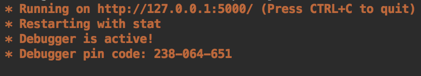
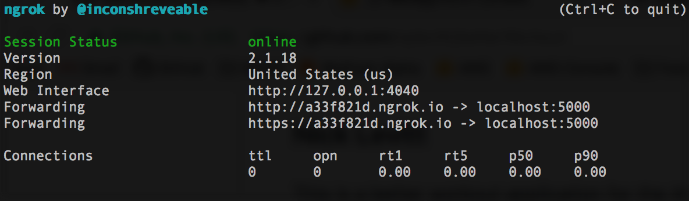
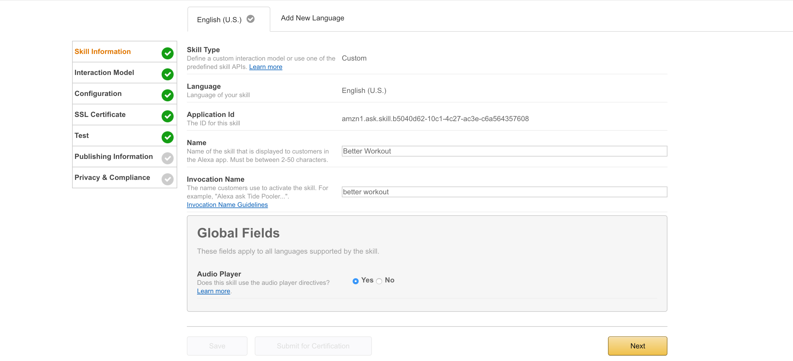
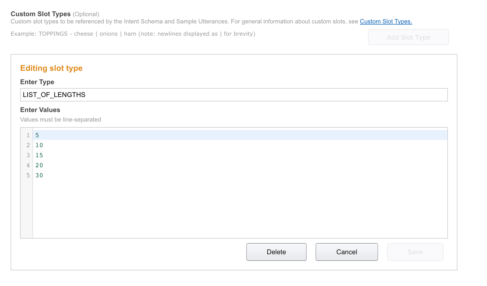

# Better Workout for Amazon Alexa
## Nick Levitt

This is a better workout application for the Amazon Alexa. It will build a random workout each time from a set of 18 different exercises.

### Running Better Workout Locally

You can launch Better Workout with the following command:

		`python betterWorkout.py -bucket https://<your_s3_bucket_here>.amazonaws.com/clocks/ -clock_json clocks_dict.json`

It should look like this:

The bucket argument should be a directory in an Amazon S3 bucket which contains all the mp3 files for the "clocks" that play during exercises. These can be anything you want: alarms, ticking, music, goat sounds, etc. The durations of these clocks should map to intervals of 30 seconds. That is, there should be a clock for 30 seconds, 60 seconds, 90 seconds ... 330 seconds. These should map to the values in the `clocks_dict.json` file. This file can be modified as necessary to match the names of the files in the S3 bucket.

The easiest method I have found for running this Application short of hosting it on AWS is through ngrok (see https://youtu.be/cXL8FDUag-s?t=83 for information on how to do this). Once ngrok is launched, it should look like this:

The `intents.txt` and `utterance.txt` files in the repo can be copied and pasted into the developers console when setting up the app.

### Setting Up Better Workout

You can set up Better Workout to run using the Amazon Developers Console. If you do not have an Amazon Developers account, make one now. Then, at https://developer.amazon.com/edw/home.html#/skills/list, you can click the `Add a New Skill` button. This will take you to the page to initialize your app. Select "Custom Interaction Model" under "Skill Type", and set your name and invocation name. My page looks like below:

Clicking Next, you will be taken to the Interaction Model page. You can simply copy and paste the `intents.txt` and `utterances.txt` files to the associated fields. Add a `Custom Slot Type`, call it `LIST_OF_LENGTHS` and give it the possible values of 5, 10 15, 20 and 30; such as below:

 
Clicking Next, you will be taken to the Configurations Page. Select `HTTPS` as the `Service Endpoint Type`, `North America` as the region, and copy and paste the ngrok address into the field.

Clicking Next, you will be taken to the SSL Certificate page. Select `My development endpoint is a sub-domain of a domain that has a wildcard certificate from a certificate authority` and click Next.

You will be taken to the page to test the app, you can do such now by typing "Start 5 Minute Workout" into the utterance field and clicking `Ask Better Workout`. 

If this all works, the Better Workout application should be ready for use on your Amazon Alexa!

### Using Better Workout

Once running, you can launch Better Workout by saying "Alexa, Launch Better Workout." This will start the application and trigger the launch intent. At this point you cal tell the application to start a 5 minute, 10 minute, 15 minute, 20 minute or 30 minute workout. 

Happy Working Out!